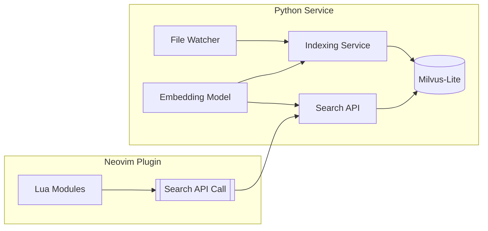

# Vector Similarity Search Implementation Plan (Auto Context)

## 1. Architecture Overview



## 2. Implementation Phases

### Phase 1: Core Indexing Service
- [x] **Python Service Setup**
  - [x] Create new service under `python/auto_context`
  - [x] Setup uv dependency management:
    ```toml
    [dependencies]
    milvus-lite
    transformers
    python-dotenv
    watchdog
    ```

- [ ] **Periodic File Indexing**
  - [ ] Implement timer-based indexing (every 5-10 minutes)
  - [ ] Use git for change detection:
    ```bash
    git ls-files --modified --others --exclude-standard
    ```
  - [ ] Fallback to `fd` for non-git repos and initial indexing
  - [ ] Track file modification times for incremental updates

- [ ] **Indexing Pipeline**
  - [x] File discovery implementation:
    - [x] Created `file_discovery.py` with `FileDiscovery` and `python/auto_context/chunker.py` classes
    - [x] Default extensions support (.py, .js, .ts, .jsx, .tsx, .vue, .rs, .go, .java, .cpp, .c, .h, .hpp, .cs, .rb, .php, .scala, .kt, .lua)
    - [x] Efficient file discovery using `fd --type f --hidden --exclude .git --exclude node_modules -e <extensions>`
    - [x] Implemented batched processing (50 files per batch)
    - [x] Added error handling and logging
  - [ ] Code parsing:
    - [x] Tree-sitter queries implementation:
      - [x] Created language-specific queries for 19+ languages
      - [x] Support for classes, functions, methods extraction
      - [x] Documentation comment capture
      - [x] Structural parsing (nested definitions, references)
    - [x] Implement smart chunking:
      - [x] Use tree-sitter to extract meaningful code blocks
      - [x] Preserve context hierarchy (class/function relationships)
      - [x] Include associated documentation
      - [x] Fallback to 100-line chunks for unsupported languages
  - [ ] **Embedding Generation**:
    - [ ] Use `gte-modernbert-base` model from https://huggingface.co/Alibaba-NLP/gte-modernbert-base
    - [ ] Implement batch processing:
      - [x] File batching: Process 50 files at a time (implemented in FileBatcher)
      - [ ] Embedding batching: Generate embeddings in batches of 32 chunks

Next Steps:
1. Implement code chunking functionality
2. Integrate FileDiscovery with CodeIndexer
3. Add tests for FileDiscovery and FileBatcher
4. Implement embedding generation with batching

- [ ] **Milvus-Lite Integration**
  - [x] Define collection schema in Python:
    ```python
    fields = [
        FieldSchema(name="id", dtype=DataType.INT64, is_primary=True),
        FieldSchema(name="embedding", dtype=DataType.FLOAT_VECTOR, dim=768),
        FieldSchema(name="metadata", dtype=DataType.JSON),
        FieldSchema(name="source_code", dtype=DataType.TEXT)
    ]
    ```

  - [ ] Mirror schema in Lua configuration:
    ```lua
    {
      source_code = {
        type = 'text',
        analyzer = 'bm25',
        stored = true
      },
      metadata = {
        type = 'object',
        fields = {
          file_path = { type = 'keyword' },
          language = { type = 'keyword' },
          git_info = {
            repo = 'text',
            last_commit = 'date'
          },
          code_context = {
            functions = 'text',
            classes = 'text',
            imports = 'text'
          }
        }
      }
    }
    ```

### Phase 2: Neovim Integration
- [ ] **Python Service Management**
  - [ ] Create `auto_context.lua` service, matching `lua/llm-sidekick/litellm.lua` example
  - [ ] Implement service lifecycle management (start/stop)

- [ ] **API Integration**
  - [ ] Implement search endpoint:
    - [ ] GET /search?query= - Return search results
  - [ ] Add error handling and retry logic
  - [ ] Implement response caching

### Phase 3: Auto Context Service Integration
- [ ] **Service Setup**
  - [ ] Create new endpoint in `python/auto_context`
  - [ ] Add FastAPI route for context retrieval
  - [ ] Environment configuration using:
    ```toml
    [dependencies]
    fastapi = "^0.95.0"
    uvicorn = "^0.21.0"
    ```

- [ ] **Context Retrieval Flow**
  - [ ] Input: Accept current code context (file path, cursor position)
  - [ ] Processing:
    - [ ] Extract relevant code context
    - [ ] Generate semantic embeddings
    - [ ] Query the indexed codebase
  - [ ] Output: Provide relevant code snippets with similarity scores

- [ ] **Neovim Integration**
  - [ ] Add Lua API wrapper for context service
  - [ ] Implement a keybinding for invoking context retrieval
  - [ ] Ensure branch safety (index versioning per git branch)

- [ ] **Performance Considerations**
  - [ ] Setup async indexing queue
  - [ ] Implement LRU cache for frequent queries
  - [ ] Optimize file watcher performance

- [ ] **Error Handling**
  - [ ] Fallback to keyword search on embedding failure
  - [ ] Apply circuit breaker pattern for API calls
  - [ ] Handle file watcher errors gracefully

## 4. Development Milestones

| Milestone | Description | ETA |
|-----------|-------------|-----|
| M1        | Core indexing service with file watcher | 4d |
| M2        | Search API integration | 2d |
| M3        | Performance optimizations | 2d |

## 5. Risk Mitigation

- [ ] **Large Codebases**:
  - [ ] Implement progressive indexing
  - [ ] Set up memory monitoring
  - [ ] Optimize file watcher for large directories

- [ ] **Unsupported Files**:
  - [ ] Use line-based chunk fallback
  - [ ] Allow configurable exclude patterns

- [ ] **Model Size**:
  - [ ] Handle on-demand download (~450MB)
  - [ ] Consider optional model quantization

## 6. UV Usage Guide

### Dependency Management

- [x] Run dependency installation:
  ```bash
  # Install dependencies
  uv sync
  ```

### Project Configuration

- [x] Manage dependencies via `pyproject.toml`:

### Configuration Tips

- [ ] Use `uv run` for consistent Python version management
- [ ] Prefer `uv sync` for reproducible environments
- [ ] Refer to UV installation instructions in README.md
