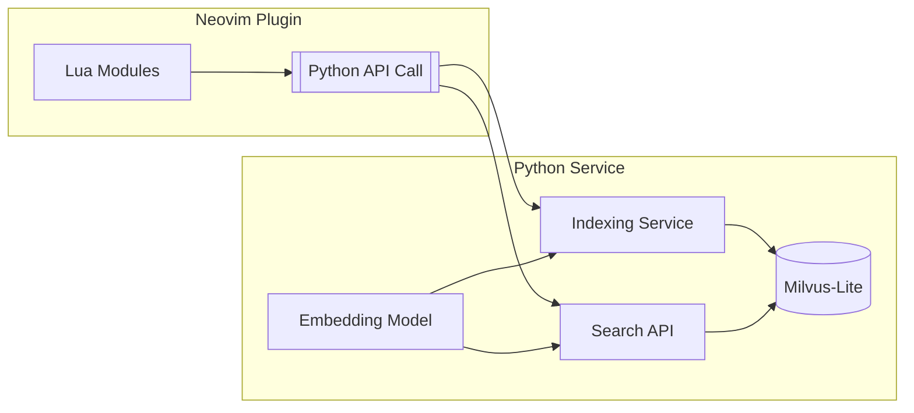

````markdown
# Vector Similarity Search Implementation Plan (Auto Context)

## 1. Architecture Overview



## 2. Implementation Phases

### Phase 1: Core Indexing Service
- [ ] **Python Service Setup**
  - [x] Create new service under `python/auto_context`
  - [x] Setup uv dependency management:
    ```toml
    [dependencies]
    milvus-lite
    transformers
    python-dotenv
    watchdog
    ```

- [ ] **Indexing Pipeline**
  - [ ] File discovery: `fd --type f --hidden --exclude .git`
  - [ ] Code parsing:
    - [ ] Use Tree-sitter for supported languages
    - [ ] Fallback: 100-line chunks if needed
  - [ ] **Embedding Generation**:
    - [ ] Use `gte-modernbert-base` model from https://huggingface.co/Alibaba-NLP/gte-modernbert-base
    - [ ] Implement batch processing

- [ ] **Milvus-Lite Integration**
  - [ ] Define collection schema in Python:
    ```python
    fields = [
        FieldSchema(name="id", dtype=DataType.INT64, is_primary=True),
        FieldSchema(name="embedding", dtype=DataType.FLOAT_VECTOR, dim=768),
        FieldSchema(name="metadata", dtype=DataType.JSON),
        FieldSchema(name="source_code", dtype=DataType.TEXT)
    ]
    ```

  - [ ] Mirror schema in Lua configuration:
    ```lua
    {
      source_code = {
        type = 'text',
        analyzer = 'bm25',
        stored = true
      },
      metadata = {
        type = 'object',
        fields = {
          file_path = { type = 'keyword' },
          language = { type = 'keyword' },
          git_info = {
            repo = 'text',
            last_commit = 'date'
          },
          code_context = {
            functions = 'text',
            classes = 'text',
            imports = 'text'
          }
        }
      }
    }
    ```

### Phase 2: Neovim Integration
- [ ] **Python Service Management**
  - [ ] Integrate service with UV, matching `litellm.lua` example:
    ```lua
    local uv = require("llm-sidekick.utils.uv")
    local auto_context = uv.new_service({
        name = "auto_context",
        command = "python -m auto_context",
        cwd = "python/auto_context"
    })
    ```

- [ ] **API Endpoints**
  - [ ] Implement endpoints:
    - [ ] POST /index/update - Trigger full reindex
    - [ ] POST /index/incremental - Handle buffer writes
    - [ ] GET /search?query= - Return top 10 results

- [ ] **Update Strategies**
  - [ ] Real-time update via autocmd: 
    ```lua
    autocmd BufWritePost * lua require('auto_context').handle_write(vim.fn.expand('<afile>'))
    ```
  - [ ] Periodic update using UV timer every 10 minutes

### Phase 3: Auto Context Service Integration
- [ ] **Service Setup**
  - [ ] Create new endpoint in `python/auto_context`
  - [ ] Add FastAPI route for context retrieval
  - [ ] Environment configuration using:
    ```toml
    [dependencies]
    fastapi = "^0.95.0"
    uvicorn = "^0.21.0"
    ```

- [ ] **Context Retrieval Flow**
  - [ ] Input: Accept current code context (file path, cursor position)
  - [ ] Processing:
    - [ ] Extract relevant code context
    - [ ] Generate semantic embeddings
    - [ ] Query the indexed codebase
  - [ ] Output: Provide relevant code snippets with similarity scores

- [ ] **Neovim Integration**
  - [ ] Add Lua API wrapper for context service
  - [ ] Implement a keybinding for invoking context retrieval
  - [ ] Ensure branch safety (index versioning per git branch)

- [ ] **Performance Considerations**
  - [ ] Setup async indexing queue
  - [ ] Implement LRU cache for frequent queries

- [ ] **Error Handling**
  - [ ] Fallback to keyword search on embedding failure
  - [ ] Apply circuit breaker pattern for API calls

## 4. Development Milestones

| Milestone | Description | ETA |
|-----------|-------------|-----|
| M1        | Core indexing service | 3d |
| M2        | Neovim API integration | 2d |
| M3        | Buffer update tracking | 1d |
| M4        | Performance optimizations | 2d |

## 5. Risk Mitigation

- [ ] **Large Codebases**:
  - [ ] Implement progressive indexing
  - [ ] Set up memory monitoring

- [ ] **Unsupported Files**:
  - [ ] Use line-based chunk fallback
  - [ ] Allow configurable exclude patterns

- [ ] **Model Size**:
  - [ ] Handle on-demand download (~450MB)
  - [ ] Consider optional model quantization

## 6. UV Usage Guide

### Dependency Management

- [x] Run dependency installation:
  ```bash
  # Install dependencies
  uv sync
  ```

### Project Configuration

- [x] Manage dependencies via `pyproject.toml`:

### Configuration Tips

- [ ] Use `uv run` for consistent Python version management
- [ ] Prefer `uv sync` for reproducible environments
- [ ] Refer to UV installation instructions in README.md
````
